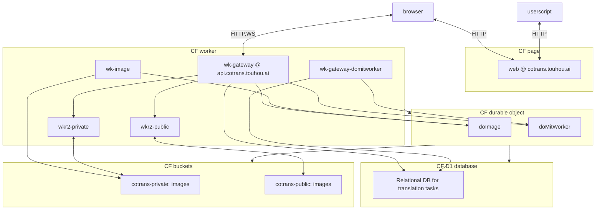

# Cotrans

A working-in-progress collaborative online image/manga translation platform base on
[manga-image-translator](https://github.com/zyddnys/manga-image-translator).

## Contributing

### Repository structure

| Path         | Description                |
| ------------ | -------------------------- |
| `docs`       | Documentations             |
| `specs`      | OpenAPI specs (TODO)       |
| `proto`      | Protobuf definitions       |
| `proto-rs`   | Prost definitions          |
| `migrations` | Database migrations        |
| `types`      | TypeScript definitions     |
| `wk-gateway` | Gateway worker             |
| `wk-image`   | Image processing worker    |
| `img_hash`   | Fork of `image_hasher`     |
| `wkr2`       | R2 worker (private/public) |
| `web`        | Website                    |
| `web-ext`    | Browser extension          |
| `userscript` | UserScript                 |

#### Service structure

